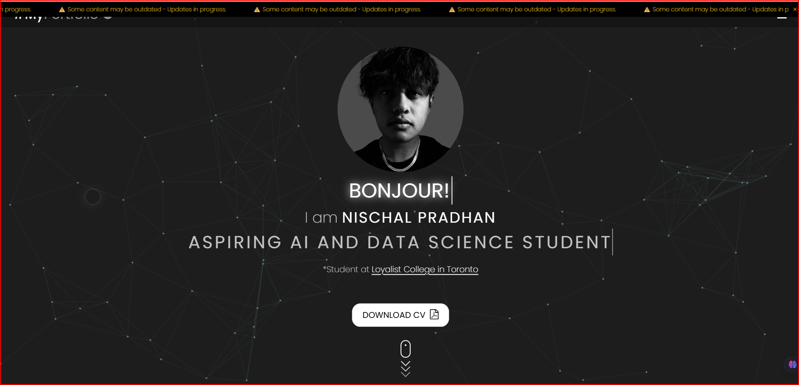
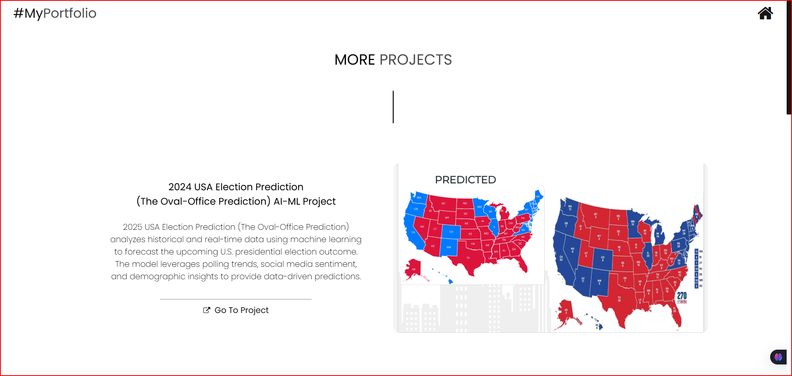

# Nischal Pradhan — Personal Portfolio || 

> A personal portfolio website built with **Python Flask**, showcasing my projects, skills, work experience, and blog — migrated from a static HTML/CSS/JS site to a full server-side rendered Flask application.

🌐 **Live Site:** [nischal-pradhan.onrender.com](https://nischal-pradhan.onrender.com) *(update once deployed)*  
📄 **Old Static Site:** [nischal-pradhan.github.io](https://nischal-pradhan.github.io)

---

## 📸 Preview

| Home | Projects | Contact |
|------|----------|---------|
|  |  |  |

> *(Add screenshots to `static/img/` and update paths above)*

---

## 🚀 Features

- **Animated neural network** background on the home page
- **Cursor trailer** effect across all pages
- **Scroll progress bar** and parallax effects
- **Typing greeting** animation (Hello, Bonjour!)
- **Hamburger overlay** navigation menu
- **Fade-in on scroll** animations for sections
- **Image/video hover** on project cards
- **Scrolling marquee** tech skill icons (About page)
- **Contact form** with Flask POST handling and flash messages
- **Downloadable ATS-optimized CV** (PDF)
- **Fully dark themed** across all pages
- **Responsive design** for mobile and desktop

---

## 🛠️ Tech Stack

| Layer | Technology |
|-------|-----------|
| Backend | Python, Flask |
| Templating | Jinja2 |
| Frontend | HTML5, CSS3, JavaScript (Vanilla) |
| Icons | Font Awesome 4.7 |
| Fonts | Google Fonts (Poppins) |
| Deployment | Render (planned) |
| Version Control | Git, GitHub |

---

## 📁 Project Structure

```
portfolio-flask/
├── app.py                        # Flask app & route definitions
├── requirements.txt              # Python dependencies
├── Procfile                      # For Render/Gunicorn deployment
├── README.md                     # You are here
│
├── templates/                    # Jinja2 HTML templates
│   ├── base.html                 # Base layout (shared <head>, CDN links)
│   ├── index.html                # Home page  (/)
│   ├── about.html                # About Me   (/about)
│   ├── projects.html             # Projects   (/projects)
│   ├── blog.html                 # Blog       (/blog)
│   └── contact.html              # Contact    (/contact)
│
└── static/
    ├── css/
    │   └── style.css             # Main stylesheet (dark theme)
    ├── js/
    │   └── script.js             # Neural bg, parallax, nav, scroll
    ├── docs/
    │   └── CV-Nischal-Pradhan.pdf  # ATS-optimized CV
    └── img/
        ├── icons/                # Tech skill icons (14 SVG/PNG)
        └── projects/             # Project screenshots & demo videos
```

---

## ⚙️ Local Setup

### Prerequisites
- Python 3.10+
- pip

### Steps

```bash
# 1. Clone the repository
git clone https://github.com/Nischal-Pradhan/flask-portfolio.git
cd flask-portfolio/portfolio-flask

# 2. Create and activate a virtual environment
python -m venv venv

# On macOS/Linux:
source venv/bin/activate

# On Windows:
venv\Scripts\activate

# 3. Install dependencies
pip install -r requirements.txt

# 4. Run the development server
python app.py
```

Then open your browser at: **http://127.0.0.1:5000**

---

## 🌍 Deployment (Render)

This app is configured for deployment on [Render](https://render.com) — free tier available.

### Steps

1. Push your project to GitHub
2. Go to [render.com](https://render.com) → **New → Web Service**
3. Connect your GitHub repo
4. Set the following:

| Setting | Value |
|---------|-------|
| **Build Command** | `pip install -r requirements.txt` |
| **Start Command** | `gunicorn app:app` |
| **Environment** | Python 3 |

5. Click **Deploy** — your app goes live at `https://your-app.onrender.com`

> Make sure `gunicorn` is in your `requirements.txt` and a `Procfile` exists:
> ```
> web: gunicorn app:app
> ```

---

## 📄 Pages & Routes

| Route | Page | Description |
|-------|------|-------------|
| `/` | Home | Hero section, about preview, project cards, blog preview |
| `/about` | About Me | Skills marquee, education, work experience |
| `/projects` | Projects | Detailed project cards with image/video hover |
| `/blog` | Blog | AI/ML blog posts grid |
| `/contact` | Contact | Contact form (Flask POST) + info panel |

---

## 📬 Contact Form

The contact form uses Flask's `request.form` and `flash()` for user feedback.  
To enable **email sending**, integrate Flask-Mail:

```bash
pip install Flask-Mail
```

```python
# In app.py
from flask_mail import Mail, Message
app.config['MAIL_SERVER'] = 'smtp.gmail.com'
app.config['MAIL_USERNAME'] = os.environ.get('MAIL_USERNAME')
app.config['MAIL_PASSWORD'] = os.environ.get('MAIL_PASSWORD')
```

---

## 🔗 Links

- 💼 LinkedIn: [linkedin.com/in/nischal-pradhan](https://www.linkedin.com/in/nischal-pradhan-944b651b3)
- 🐙 GitHub: [github.com/Nischal-Pradhan](https://github.com/Nischal-Pradhan)

---

## 📝 License

© 2025 Nischal Pradhan. All rights reserved.
